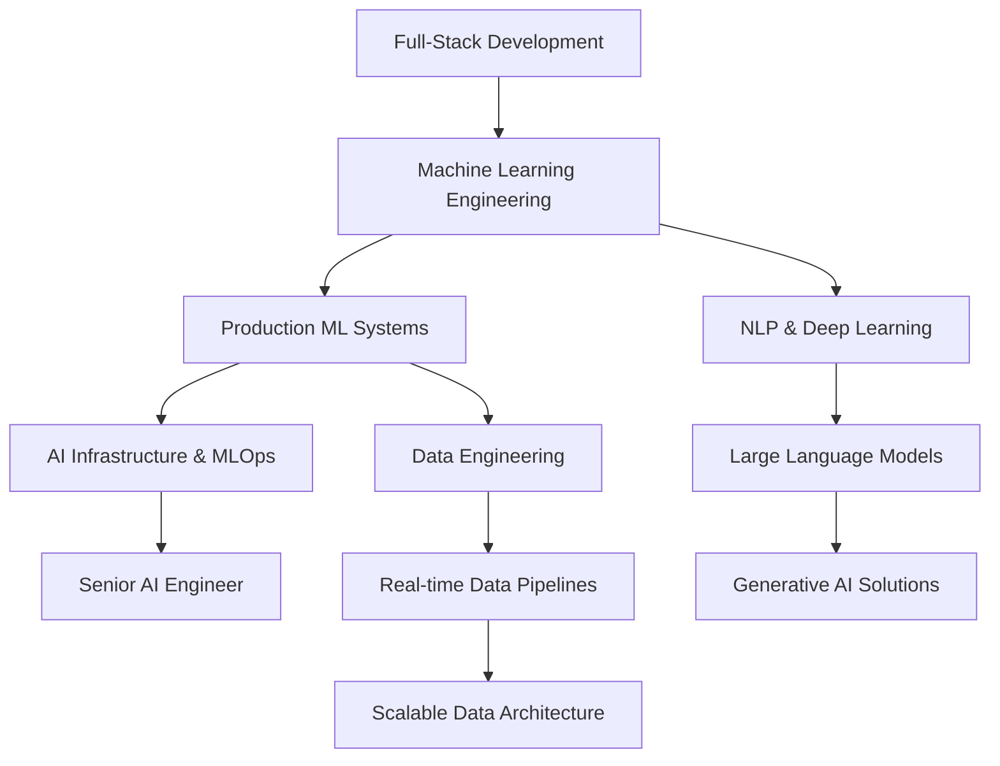

<h1 align="center">
  
</h1>

  <b>Junior Machine Learning Engineer | AI & Data Science</b> 
  Tunis, Tunisia 🇹🇳

  

  <a href="https://boughanmiyoussef.github.io/">🌐 Portfolio</a> •
  <a href="https://linkedin.com/in/youssef-boughanmi-4990222a0">💼 LinkedIn</a> •
  <a href="mailto:yussefboughanmy@gmail.com">✉️ Email</a>

---

## 👋 About Me

I'm **Youssef Boughanmi**, a **Junior Machine Learning Engineer** passionate about building **end-to-end AI systems** that solve real-world problems. I bridge the gap between cutting-edge machine learning research and production-ready applications.

### 🔍 What I Do
- **Machine Learning & AI**: Time series forecasting, NLP, anomaly detection, predictive modeling
- **Full-Stack Development**: Building complete applications from model to deployment
- **Data Engineering**: ETL pipelines, data warehousing, Medallion Architecture
- **MLOps & Deployment**: Docker, Streamlit, cloud-based inference

### 🎯 Current Focus
- Scaling machine learning models to production
- Building robust data pipelines for real-time systems
- Exploring advanced deep learning architectures
- Contributing to open-source AI projects

---

## 🧠 Core Expertise

**Artificial Intelligence & Machine Learning**
- Classical ML (Scikit-learn, XGBoost, ensemble methods)
- Deep Learning (TensorFlow, PyTorch, LSTM)
- NLP (NLTK, TF-IDF, text classification)
- Time Series Analysis (forecasting, anomaly detection)
- Model Optimization (Optuna, hyperparameter tuning)
- Model Interpretability (SHAP, feature importance)

**Data Engineering**
- ETL Pipeline Development
- Medallion Architecture (Bronze, Silver, Gold)
- Data Warehousing & Star Schema
- SQL Server & T-SQL
- Data Transformation & Deduplication

**Software Engineering**
- Full-Stack Development (MERN stack)
- RESTful API Design
- Database Modeling (SQL & NoSQL)
- Performance Optimization
- Clean Code & Architecture

**DevOps & Tools**
- Docker Containerization
- Linux & Bash
- Git & Collaborative Workflows
- CI/CD Pipelines
- Streamlit & Deployment Platforms

---

## 🚀 Featured Projects

### 📊 **StarBias - Fandango Rating Bias Analysis** | *Apr 2026 – May 2026*
> *Analyzing systematic rating inflation across movie platforms*

- Built a system to detect rating inflation across multiple movie platforms
- Designed cross-platform normalization pipeline for heterogeneous rating scales
- Applied statistical comparison across 510+ movies to measure rating inconsistencies
- **Identified 0.93-star inflation and 29.5% systematic overrating bias** in Fandango

**Tech:** Python, Pandas, NumPy, Plotly, Streamlit, Render

---

### 📈 **StockSentinel - Financial Anomaly Detection System** | *Mar 2026 – Apr 2026*
> *Real-time detection of market volatility spikes*

- Developed real-time anomaly detection system for financial market volatility spikes
- Implemented Isolation Forest and Z-score methods for unsupervised outlier detection
- Engineered streaming financial indicators including RSI, volatility, and volume-based signals
- **Reduced data latency by 40%** while enabling real-time monitoring via interactive dashboard

**Tech:** Python, Scikit-Learn, Pandas, Plotly, Streamlit, APIs, Render

---

### 🚲 **BikeDemand - Temporal Demand Forecasting Platform** | *Jan 2026 – Feb 2026*
> *Accurate hourly bike demand prediction*

- Designed a forecasting system for hourly bike demand prediction
- Implemented time-series ML pipeline with engineered cyclical temporal features
- Applied TimeSeriesSplit validation and hyperparameter optimization for robustness
- **Achieved R² = 0.9162 and RMSE = 63.62** on validation data

**Tech:** Python, Scikit-Learn, Optuna, SHAP, Time Series Analysis

---

### 🏠 **HomeValue - Housing Price Prediction System** | *Sep 2025 – Oct 2025*
> *Real estate price estimation with stacking ensemble*

- Designed a regression system for real estate price estimation
- Engineered 39+ predictive features using transformations and interaction modeling
- Integrated stacking ensemble combining multiple gradient boosting models
- **Achieved R² = 0.8395** and deployed a production inference application

**Tech:** Python, Scikit-Learn, XGBoost, Optuna

---

### 🔍 **FactCheck - AI Fake News Detection System** | *Jun 2025 – Jul 2025*
> *Large-scale fake news identification system*

- Developed NLP classification system for fake news detection on large-scale datasets
- Implemented TF-IDF vectorization with Logistic Regression for text classification
- Applied cross-validation strategy to ensure model generalization and stability
- **Achieved 95.2% accuracy and 0.990 ROC-AUC** on 20,000+ articles

**Tech:** Python, Scikit-learn, Pandas, NLTK, TF-IDF, Logistic Regression

---

### ⭐ **ReviewRadar - IMDB Movie Review Sentiment Analysis** | *May 2025 – Jun 2025*
> *Sentiment classification on 50,000 movie reviews*

- Designed sentiment classification system for large-scale movie review data
- Engineered high-dimensional TF-IDF feature representation (10,000+ features)
- Applied L2-regularized Logistic Regression for stable text classification
- **Achieved 89.74% accuracy and 0.898 F1-score** on 50,000 IMDb reviews

**Tech:** Python, Scikit-Learn, NLTK, TF-IDF, Logistic Regression

---

### 🗄️ **MedallionDB - Data Warehouse & ETL Pipeline** | *Feb 2025 – Mar 2025*
> *Enterprise-grade data warehousing solution*

- Architected Medallion-style data warehouse with Bronze, Silver, and Gold layers
- Implemented ETL workflows using SQL Server stored procedures and transformation logic
- Modeled star schema optimized for analytical query performance
- Containerized pipeline using Docker for reproducible data engineering setup

**Tech:** SQL Server, T-SQL, Docker, Medallion Architecture, Data Warehousing

---

## 🛠️ Technology Stack

### Programming Languages

### Machine Learning & AI

### Data Engineering

### DevOps & Deployment

---

## 🎓 Education

**Holberton School — Tunis, Tunisia**
*Full-Stack Software Engineering – Machine Learning Specialization*
**December 2024 – June 2026**

**Relevant Coursework:**
- Advanced Machine Learning (TensorFlow, PyTorch)
- Deep Learning & Neural Networks
- Data Engineering & ETL Pipelines
- DevOps & Containerization
- Algorithm Design & Optimization
- Natural Language Processing

---

## 📈 GitHub Statistics

  

  

  

---

## 🗺️ Career Roadmap

---

## 💡 Engineering Philosophy

> *"Engineering is not just about making things work — it's about making them reliable, scalable, and meaningful."*

I believe in:
- **Clean Code**: Writing maintainable, documented, and testable code
- **Clear Thinking**: Solving problems systematically and efficiently
- **Responsible AI**: Building ethical, transparent, and fair AI systems
- **Continuous Learning**: Staying updated with the latest technologies
- **Open Source**: Contributing to the community and learning from others

Every project I build aims to solve real problems with long-term impact.

---

## 📊 Current Learning Focus

- 🧠 Advanced Deep Learning Architectures
- ⚡ Real-time ML Systems
- 🏗️ MLOps & Model Monitoring
- 🤖 Large Language Models (LLMs)
- ☁️ Cloud-native AI Solutions

---

## 📬 Get in Touch

I'm always open to interesting conversations, collaboration opportunities, and new challenges!

  
  
  
  

  <i>Open to AI/ML roles, Software Engineering positions, research collaborations, and impactful startups.</i>

---

## 🏆 Key Highlights

- 🎓 **Holberton School** — Full-Stack Software Engineering with ML Specialization (2024–2026)
- 💻 **7+ End-to-End ML Projects** — From data engineering to production deployment
- 📊 **High-Performance Models** — Achieved 95.2% accuracy on fake news detection, R² = 0.9162 on demand forecasting
- 🔧 **Production Experience** — Deployed multiple applications using Streamlit, Docker, and Render
- 📈 **Data Engineering** — Built Medallion Architecture data warehouses with ETL pipelines

---

## 📚 Continuous Learning

- 🧠 Currently advancing skills in Deep Learning (TensorFlow, PyTorch)
- ⚡ Exploring MLOps and real-time system deployment
- 🤖 Building expertise in NLP and time series forecasting
- ☁️ Learning cloud-native AI solutions and containerization

---

  

---

  <i>⭐️ From <a href="https://github.com/boughanmiyoussef">Youssef Boughanmi</a> | Built with ❤️</i>

