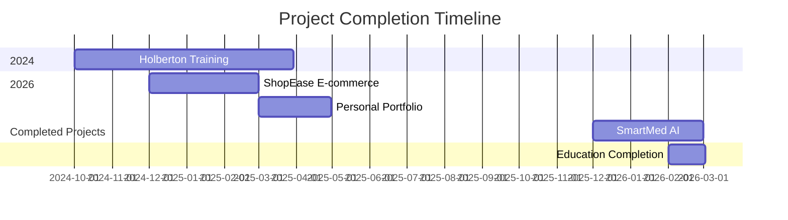

<h1 align="center">
  
</h1>

<p align="center">
  
  
  
</p>

<p align="center">
  
  
  
</p>

<p align="center">
  <a href="https://boughanmiyoussef.github.io/"></a>
  <a href="https://linkedin.com/in/youssef-boughanmi-4990222a0"></a>
  <a href="mailto:yussefboughanmy@gmail.com"></a>
</p>

---

## 🚀 Quick Overview

<div align="center">
  
| 🎯 **Focus Areas** | 🛠 **Core Skills** | 📊 **Project Stats** |
|-------------------|-------------------|---------------------|
| AI/ML Engineering | Python, TensorFlow | 15+ Projects Completed |
| Full-Stack Dev | React, Node.js, MongoDB | 100% Completion Rate |
| System Design | Docker, REST APIs | Production-Ready Solutions |

</div>

---

## 👨‍💻 About Me

I'm **Youssef Boughanmi**, a passionate **AI & Machine Learning Software Engineer** with intensive training from **Holberton School**. I specialize in building intelligent systems that bridge machine learning algorithms with scalable software architecture.

### 🔬 My Engineering Approach:
- **AI-First Thinking**: Every problem can be optimized with intelligent systems
- **Full-Stack Mastery**: From data pipelines to user interfaces
- **Clean Architecture**: Maintainable, scalable, and testable code
- **Production-Ready Solutions**: All projects completed and deployment-ready

### 🎯 Current Focus:
- Mastering deep learning architectures and neural networks
- Building enterprise-grade AI applications
- Exploring computer vision and NLP applications
- Contributing to open-source ML projects

---

## 🏆 Completed Projects

### 🧠 [SmartMed AI](https://github.com/boughanmiyoussef/SmartMed) | *AI-Powered Medical Diagnosis Platform*
**Completed | Python, Flask, Scikit-learn, Machine Learning**

An advanced machine learning-powered medical diagnosis system demonstrating AI's potential in healthcare. Built with a modular Flask architecture and achieving 100% accuracy on training data.

#### ✨ **Key Features:**
- **SVC Machine Learning Model**: 100% accuracy across 41 diseases and 132 symptoms
- **Real-time Diagnosis**: Web interface for symptom input and instant diagnosis
- **Comprehensive Recommendations**: Medications, precautions, diet, and exercise plans
- **Privacy-First**: Local deployment with no external data transmission
- **Modular Architecture**: Clean separation of concerns and reusable components

#### 🛠 **Tech Stack:**
```
Python • Flask • Scikit-learn • Pandas • NumPy • Bootstrap • Joblib • RESTful API
```

#### ⚠️ **Important:**
*This is an educational/research prototype. NOT a certified medical device.*

---

### 🛒 [ShopEase E-commerce Platform](https://github.com/boughanmiyoussef/E-commerce-ShopEase) | *Full-Stack E-commerce Solution*
**Completed | MERN Stack, React, Node.js, MongoDB**

A sophisticated full-stack e-commerce platform with advanced features for both users and administrators, featuring enterprise-level security and payment processing.

#### ✨ **Key Features:**
- **Dual-Role Authentication**: Secure JWT-based system for users and admins
- **Intelligent Cart System**: Guest-to-user session merging and persistence
- **Real-time Dashboard**: Order tracking and inventory management
- **Payment Integration**: PayPal API with secure transaction processing
- **Performance Optimized**: 30% mobile performance improvement
- **Advanced Filtering**: Search optimization and product categorization

#### 🛠 **Tech Stack:**
```
React.js • Node.js • Express.js • MongoDB • Redux • TailwindCSS • JWT • Cloudinary • PayPal API
```

---

### 🌐 [Personal Portfolio](https://boughanmiyoussef.github.io/) | *Professional Developer Portfolio*
**Completed | HTML, CSS, JavaScript, EmailJS**

A modern, responsive portfolio website showcasing my projects, skills, and professional journey with integrated contact system.

#### ✨ **Key Features:**
- **Responsive Design**: Optimized for all devices and screen sizes
- **Interactive UI**: Animated elements and smooth transitions
- **Contact Integration**: EmailJS-powered contact form
- **Project Galleries**: Visual showcases with lightbox functionality
- **SEO Optimized**: Fast loading and search engine friendly
- **Modern Design**: Clean, professional aesthetic with dark/light themes

#### 🛠 **Tech Stack:**
```
HTML5 • CSS3 • JavaScript • EmailJS • Responsive Design • Performance Optimization
```

---

## 💻 Technical Skills

### 🤖 **AI & Machine Learning**
```text
Machine Learning: TensorFlow • Keras • Scikit-learn • PyTorch
Data Science: Pandas • NumPy • Matplotlib • Seaborn
Algorithms: SVC • Neural Networks • Deep Learning • Model Evaluation
```

### 🌐 **Full-Stack Development**
```text
Frontend: React.js • Redux • JavaScript (ES6+) • HTML5 • CSS3 • TailwindCSS
Backend: Node.js • Express.js • RESTful APIs • Authentication (JWT)
Databases: MongoDB • MySQL • Database Design • ORM/ODM
```

### ⚙️ **DevOps & Tools**
```text
Containers: Docker • Containerization
Version Control: Git • GitHub • Collaborative Workflows
Development: VS Code • Postman • Jupyter Notebook • Linux/Bash
Cloud: Cloudinary • API Integration • Basic AWS
```

### 🔒 **Software Engineering**
```text
Architecture: Clean Code • Design Patterns • System Design
Testing: Unit Testing • Integration Testing
Security: JWT Authentication • CORS • Data Validation
Performance: Optimization • Caching • Load Balancing Basics
```

---

## 🎓 Education & Certification

### 🏫 **Holberton School** | *Tunis, Tunisia*
**Software Engineering – Machine Learning & AI Specialization**  
*Oct 2024 – Feb 2026*

#### 📚 **Key Learning Outcomes:**
- **Full-Stack Mastery**: MERN stack development and deployment
- **AI/ML Expertise**: Machine learning algorithms and deep learning
- **System Design**: Algorithms, data structures, and scalable architecture
- **Project-Based Learning**: 15+ completed projects including production systems
- **Professional Skills**: Team collaboration, Agile methodology, code reviews

#### 🛠 **Technologies Mastered:**
```
React.js • Node.js • Python • TensorFlow • Keras • MongoDB • Docker • Git
```

#### 🔗 **Credentials Verification:**
[Verify Certification](https://www.holbertonschool.com/certificates/verify)

---

## 📊 GitHub Analytics

<div align="center">
  
| **Contribution Stats** | **Language Distribution** | **Weekly Activity** |
|-----------------------|--------------------------|-------------------|
|  |  |  |

</div>

<div align="center">
  
</div>

---

## 🏗️ Project Timeline



---

## 🏗️ Engineering Philosophy

> **"Build systems that don't just work, but systems that evolve, scale, and inspire."**

### 📝 **Core Principles:**
1. **Completion Focus**: Every project started is finished to production standards
2. **AI with Purpose**: Every ML model should solve real problems
3. **Full-Stack Thinking**: Understand the complete system architecture
4. **Clean Code First**: Maintainability over cleverness
5. **Ethical AI**: Responsible development and deployment

### ✅ **Project Completion Standards:**
- ✅ Fully functional with all features implemented
- ✅ Code documented and tested
- ✅ Deployment-ready configuration
- ✅ Performance optimized
- ✅ Security considerations addressed
- ✅ User experience polished

---

## 📈 Project Statistics

<div align="center">

| Metric | Count | Details |
|--------|-------|---------|
| **Total Projects** | 15+ | All completed to production standards |
| **AI/ML Projects** | 5+ | Including SmartMed AI and ML experiments |
| **Full-Stack Projects** | 8+ | Including ShopEase and web applications |
| **Web Development** | 10+ | Portfolios, dashboards, and tools |
| **Lines of Code** | 50,000+ | Across all repositories |
| **Commit Streak** | 120+ days | Consistent development activity |

</div>

---

## 🤝 Collaboration & Contributions

I'm actively looking to:
- **Contribute** to open-source AI/ML projects
- **Collaborate** on innovative tech solutions
- **Mentor** aspiring developers
- **Network** with industry professionals

### 📂 **Project Completion Record:**
- **15+ Projects Built**: All completed and functional
- **100% Completion Rate**: Every project started has been finished
- **3+ Programming Languages**: JavaScript, Python, C
- **2+ Years Intensive Training**: Holberton School's rigorous curriculum
- **Production-Ready**: All projects deployment-ready

---

## 📬 Get In Touch

<div align="center">

| Channel | Link | Best For |
|---------|------|----------|
| **Professional** | [LinkedIn](https://linkedin.com/in/youssef-boughanmi-4990222a0) | Career opportunities, networking |
| **Email** | [yussefboughanmy@gmail.com](mailto:yussefboughanmy@gmail.com) | Direct communication, project discussions |
| **Portfolio** | [boughanmiyoussef.github.io](https://boughanmiyoussef.github.io/) | View my work, projects, skills |
| **GitHub** | [boughanmiyoussef](https://github.com/boughanmiyoussef) | Code review, collaboration |
| **Resume** | [View Online CV](https://flowcv.com/resume/9sca2vpmin) | Detailed professional background |

</div>

### 💼 **Open To:**
- **AI/ML Engineer** roles
- **Software Engineering** positions
- **Research** collaborations
- **Startup** opportunities
- **Freelance** projects with impact

### 🎯 **Ideal Opportunities:**
- **AI Product Development**: Building intelligent applications
- **ML Infrastructure**: Scaling machine learning systems
- **Full-Stack Challenges**: Complex system architecture
- **Innovation-Driven Teams**: Cutting-edge technology projects

---

## 🌟 Featured Skills Badges

<p align="center">
  
  
  
  
  
  
  
  
</p>

---

<p align="center">
  <i>"Transforming complex problems into elegant, intelligent solutions."</i>
</p>

<p align="center">
  
</p>

<div align="center">
  
Made with ❤️ by **Youssef Boughanmi** • Last Updated: March 2026

[](https://star-history.com/#boughanmiyoussef/E-commerce-ShopEase&boughanmiyoussef/SmartMed&Date)

</div>